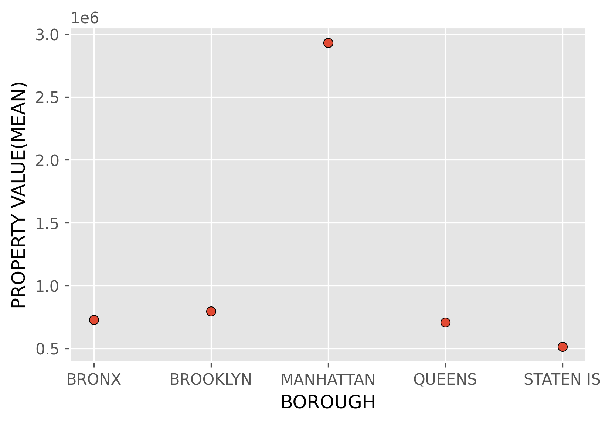

### Property Borough Assessment


Using NYC's Opendata source to explore property values from 2010 to 2019, within the five boroughs of New York City. 

This code uses ```pandas``` to answer the following questions.
  
   1. **How many properties are listed here?**
   2. **How much is the total property value for all the properties?**
   3. **What years is this dataset in reference to?**
   4. **How many properties are listed per year?**
   5. **What is the average property value per borough?**
   6. **What borough has the highest property values? the lowest?**
   7. **What is the average property value per borough per years?**
  



